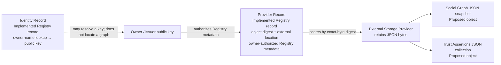

# Identity-linked Social Graph and Web of Trust

**Status:** Ecosystem-level proposed protocol specification, version 1
**Scope:** Interoperable object meaning, schema and revision rules, Registry/External Storage Provider interactions, and application boundaries. This document is not a service implementation or deployment specification.

## Purpose and claim classes

This specification defines two distinct digest-addressed JSON Storage Object families: owner-authored Social Graph snapshots and issuer-authored Trust Assertions collections. It describes how applications publish and discover those objects through the existing Registry and an External Storage Provider, how clients report what they can verify or observe, and where applications retain authority.

Claims are classified as **implemented/code-backed**, **researched but unimplemented**, **proposed protocol v1**, or **long-term goal**. These classes separate shipped Registry behavior and research context from the proposed Social Graph/Trust Assertions contract and aspirations; none implies guarantees beyond its stated evidence.

**[Implemented/code-backed]** The Registry is a working signed-record substrate. Owner-authorized Provider Record withdrawal/tombstones were added by [`decent-registry` PR #119](https://github.com/jetpen/decent-registry/pull/119), closing [Registry issue #118](https://github.com/jetpen/decent-registry/issues/118). The implementation preserves active Provider Record v1 and adds a signed Provider v2 withdrawn state, optional replacement hash, typed withdrawn lookup results, and authorized legacy/multisignature flows. It does not guarantee global propagation, cross-node compare-and-swap, external-object deletion, copy/history erasure, or mixed-version migration.

**[Proposed protocol v1]** Social Graph and Trust Assertions are ecosystem object conventions described here; they are not implemented Registry record families or companion services.

## Domain model

### Social Graph

A Social Graph Storage Object is an owner's JSON snapshot containing directed relationship entries about subjects identified by public key. The object-level `owner_public_key` names the key the object claims as its author. Each entry has a `subject_public_key` and an application-defined `predicate`; optional `context` is also application-defined.

An entry is a statement by the graph owner. It does not imply that the subject recognizes, reciprocates, consents to, or has been notified of the relationship. It does not prove a real-world identity, truth, or trustworthiness. Social Graph edges are not trust evidence by default. An application may explicitly choose to use them under its own disclosed policy.

### Trust Assertions

A Trust Assertions Storage Object is an issuer-authored JSON collection. The object-level `issuer_public_key` names the key the object claims as its issuer. Each assertion entry identifies a `subject_public_key` and a non-empty application-defined `purpose`, such as “article publisher” or “identity vouching.” The issuer's assertion is that the purpose-specific relationship holds. There is no separate standardized claim-value field or universal purpose vocabulary.

A subject need not sign or consent to another identity's statement about them. Purpose communicates the issuer's asserted relationship/scope; it is not a standard score or an application decision. In v1, the collection's issuer claim is not cryptographically signed over the JSON bytes; when an issuer signature is available in another evidence context, it authenticates only the issuer's statement, not the subject's consent or the assertion's truth. Evidence, expiry, truth, issuer competence, and interpretation are not established by the object schema.

## Content-authorship limitation

In protocol v1, neither JSON object carries a required content signature. The existing Registry Provider Record signature authenticates Registry metadata; it does not sign the referenced JSON bytes. The object-level owner/issuer key is a field in the JSON statement, not cryptographic proof that the key holder authored those bytes. Content signing is outside this version.

## Identity references, key continuity, and verification observations

The Social Graph owner and Trust Assertions issuer are referenced by their public keys in the object fields. Each relationship/assertion subject is also referenced directly by that subject's public key. The resolved identity decision #20 describes the authorized graph-owner/issuer key as the identity reference for signed records. In this protocol v1, however, the JSON object has no required content signature, so the key field is only a claim and does not cryptographically prove who authored those bytes. An Identity Record may resolve a name to a key under Registry rules, but a name, reused label, or current lookup alone does not prove that a replacement key controls the same graph or identity.

A replacement key is separate from the old-key identity and controls a separate graph unless explicit, verifiable continuity evidence links the keys, as resolved in [identity continuity decision #20](https://github.com/jetpen/decent-ecosystem/issues/20). Accepting a continuity link requires signatures by both old and new keys. If the old key is unavailable or compromised, treat the new key as separate unless an explicitly trusted continuity authority establishes the link. Never infer continuity from a reused label or claim. Apply the same identity distinction to Trust Assertions issuers: a changed issuer key is not presumed to represent the same issuer without explicit continuity evidence. This protocol's JSON schemas define no content-signature or continuity-proof format; an object's claimed owner/issuer key does not itself prove authorship or continuity.

When signature evidence exists, keep three observations distinct: whether the signature is valid for the key and bytes; whether that key was authorized at the relevant time, but only when supporting evidence establishes it; and the key/record's current status. A valid signature alone proves neither signing time nor historical authorization nor current status. Preserve records whose key or identity cannot currently be resolved and report them as unresolved/unverifiable; they are not positive identity or trust evidence by default. These rules do not establish a unique human, truth, or safety.

## Registry records and storage boundary

The Registry and External Storage Provider have separate responsibilities:

- **Identity Record (implemented Registry record):** binds an owner name/lookup identity to a public key under Registry's signed-record rules. It is not a Social Graph and does not define an owner-key-to-graph query.
- **Provider Record (implemented Registry record):** signed Registry metadata keyed by the SHA-256 digest of external object bytes. It carries the object digest, external location/provider metadata, and the owner public key that authorizes the Registry record update/withdrawal under Registry rules. Its signature authenticates that Registry metadata. Registry stores discovery metadata, not the JSON object content.
- **Social Graph / Trust Assertions Storage Object (proposed ecosystem objects):** JSON content retained by an External Storage Provider. The exact stored bytes are content-addressed by SHA-256. They are not Registry Records and are not stored in the Registry.



The arrows describe conceptual roles, not additional Registry APIs. A Provider Record signature authenticates the Registry metadata update, not the JSON bytes at the referenced location.

## V1 object schema and revision rules

Both JSON Schema files are Draft 2020-12. Public-key fields must be 64 lowercase hexadecimal characters representing 32-byte Ed25519 public keys. The Trust Assertions schema requires a non-empty string `purpose` for each assertion. The schemas reject schema versions other than `1`; this directory is the v1 profile, not a promise that later schema versions will share the same shape. The schemas validate object structure and key encoding, not cryptographic continuity; v1 defines no in-object mechanism for proving that a replacement key controls the prior key's graph.

Normative JSON Schemas are provided separately:

- [`social-graph.schema.json`](schemas/social-graph.schema.json)
- [`trust-assertion.schema.json`](schemas/trust-assertion.schema.json)

Each object family has its own independently evolving integer `schema_version`; v1 uses `schema_version: 1`. There is no runtime capability negotiation. A client either supports the declared family/schema version or reports an unsupported-version outcome. A client must not silently downgrade to older semantics.

Both object families use the same object-revision pattern:

- `id` is stable within one object's lifecycle. A semantically distinct replacement starts a new ID/lifecycle.
- `version` starts at `1` and advances by exactly one for each revision of that same ID.
- Version 1 omits `previous_digest`; every later version includes the lowercase hexadecimal SHA-256 digest of the immediate predecessor's exact stored UTF-8 JSON bytes.
- Version numbers are local to an object ID; they cannot rank different IDs or prove that a candidate is globally current.
- Two different exact byte sequences/digests claiming the same ID, family schema version, and object version are conflicting revisions. The protocol defines no merge or winner.

A required change to interpretation or validation increments the relevant family's `schema_version`, even if field shape does not change. Unknown properties are permitted in v1 and have no v1 semantics; clients ignore them and must not infer meaning or trust from them. Optional timestamps may appear as application metadata, but are informational only and do not prove signing time, authorization, freshness, or currentness.

The Social Graph and Trust Assertions drafts below specify v1 object structure. Required v1 semantics are interpreted only when `schema_version` is `1`; clients that do not support a declared family version report it as unsupported and do not silently downgrade. Unknown fields are ignored and carry no v1 semantics. A change to required interpretation or validation advances that family's schema version.

The owner/issuer public key fields are claims inside the JSON object; since v1 does not sign the JSON bytes, their presence does not cryptographically prove object authorship. Provider Record authorization remains a separate Registry metadata function.

## Exact-byte digest and object retrieval

Compute an object's discovery digest as SHA-256 over its exact stored UTF-8 JSON bytes. Do not parse, reserialize, reorder fields, normalize, or remove whitespace before hashing. A whitespace or key-order change produces different bytes and therefore a different digest even when a JSON parser would produce equivalent values.

```mermaid
sequenceDiagram
  participant App as Application
  participant Account as App-specific account/storage object
  participant Registry as Registry
  participant Store as External Storage Provider

  App->>Account: resolve under application-specific rules
  Account-->>App: Social Graph digest (optional app convention)
  App->>Registry: lookup known object digest
  Registry-->>App: Provider Record metadata or absence/unavailable
  App->>Store: fetch from returned external location
  Store-->>App: exact JSON bytes
  App->>App: hash exact UTF-8 bytes; parse supported schema
```

Foundational discovery starts with a known digest. There is no required global search index, owner-public-key-to-Social-Graph lookup, or standardized account schema. An application-specific account/storage object may refer to a Social Graph digest; an application must likewise supply or discover a Trust Assertions digest through its own mechanism. Search indexes may be used by applications, but are not foundational protocol dependencies.

A Registry lookup that positively reports no matching record is absence only within the scope of that response. Timeout, network/service error, or an inconclusive response is unavailable/unknown, not absence. If a Provider Record is returned, a client may independently check its Registry signature/authorization result and compare fetched bytes to the requested digest. Whether the application enforces any check is application policy; this spec defines the observations and limitations, not a mandatory reject/accept policy.

## Publish, revise, replace, and withdraw

### Publish

1. The owner or issuer constructs a Social Graph or Trust Assertions JSON object with its family schema version, stable ID, object revision, public-key reference, and entries.
2. The object bytes are stored with an External Storage Provider. SHA-256 of those exact bytes is the object digest.
3. The owner publishes a Provider Record to the Registry keyed by that digest, using the existing Provider Record signature purpose. The Provider Record identifies Registry discovery metadata and external location; it does not sign the JSON content.
4. The application supplies the digest to clients through its account/discovery mechanism or another application-specific path.

The Registry implements general Provider Record publication and resolution. Social Graph and Trust Assertions remain proposed content conventions rather than implemented Registry record families.

### Revise or replace

A revision to the same object lifecycle retains its stable ID, increments `version` by one, and includes the immediate predecessor digest. A semantically distinct replacement uses a new ID and starts at version 1. Publish the new bytes and Provider Record before requesting withdrawal of an older Provider Record. A higher object version does not by itself prove global currentness, select a winner across conflicting candidates, or prove identity continuity across a changed key. A replacement signing key is a separate graph unless explicit, verifiable continuity evidence links old and new keys; accept continuity only with both keys' signatures or, when the old key is unavailable/compromised, an explicitly trusted continuity authority's evidence.

### Withdraw

Owner-authorized Provider Record withdrawal/tombstones are implemented in [`decent-registry` PR #119](https://github.com/jetpen/decent-registry/pull/119), merged as `b5ea3015785115975b278c79de00750593259e52`; see [Registry issue #118](https://github.com/jetpen/decent-registry/issues/118). The implementation preserves active Provider Record v1 and adds a signed Provider payload v2 withdrawn state at the same object-hash key, with an optional replacement hash and typed withdrawn lookup/API/CLI results. It validates the current predecessor/owner/sequence and supports legacy and multisignature authorization paths; a higher-sequence active v1 Provider Record may reactivate the key. The Registry PR reported 210 passed, 1 skipped, and successful required checks.

When a client observes a withdrawn result, future discovery/use through that Provider Record stops; the client may follow an optional replacement digest. This does not delete the external Storage Object, erase Registry history, replicas, caches, or previously obtained copies, or guarantee immediate/global propagation, cross-node compare-and-swap, or that every client observes the tombstone. Pre-MVP mixed-version compatibility is not guaranteed. Applications decide how to treat cached data and observed status.

```mermaid
sequenceDiagram
  participant Author as Owner / issuer
  participant Store as External Storage Provider
  participant Registry as Registry
  participant Client as Client application

  Author->>Store: store replacement JSON bytes
  Store-->>Author: location; exact-byte digest
  Author->>Registry: publish owner-authorized Provider Record
  Author->>Registry: withdraw old Provider Record (Provider v2 tombstone)
  Client->>Registry: lookup old digest
  Registry-->>Client: withdrawn + optional replacement digest (if observed)
  Note over Client,Store: Client may follow replacement; copies and external bytes are not erased.
```

## Protocol outcome observations

- Report semantic outcomes distinctly: unsupported family schema version; malformed object or invalid required fields; exact-byte digest mismatch; Provider Record validation/authorization observation; unresolved key or continuity reference; signature validity; authorization-at-relevant-time when evidenced (otherwise unproven); current key/record status as a separate observation; confirmed Registry absence; Registry unavailable or inconclusive; external object inaccessible; conflicting revisions for the same object ID/schema version/revision.
- Conflicting revisions have no protocol-defined winner or merge. A valid Registry record with no observed withdrawal is “not known withdrawn,” not proof that it is globally latest. Applications choose verification strictness, candidate selection, rejection/acceptance, and treatment of incomplete or stale evidence. A key signature, Provider Record, or trust path does not establish a unique human, truth, competence, or safety. The semantic outcome vocabulary is summarized by optional fixture examples; it is not a required wire enum/status code, and it does not prescribe application acceptance.

## Privacy, access, and limits

The v1 design assumes Social Graph and Trust Assertions JSON objects are unencrypted and do not rely on bearer-token authorization headers at the External Storage Provider. Any client that can access the storage location can read the JSON. Publishing or withdrawing a Provider Record controls discoverability through that record, not confidentiality of known or copied bytes. Symmetric storage encryption, selective-disclosure mechanisms, and metadata-minimization mechanisms are outside this protocol version; selective disclosure and metadata minimization are aspirations, not interoperability requirements or guarantees.

Consent to publish, access, and reuse/republish remain distinct principles, but this protocol defines no permission fields, access-control mechanism, or enforcement contract; these are application policy and any required storage-service design. A subject has no veto over another identity independently making a statement. Withdrawal cannot erase disclosed or replicated copies. Sybil identities, collusion, coercion, compromise/rotation, impersonation, stale statements, and false claims remain residual risks.

## Application-owned trust interpretation

The protocol standardizes no Web-of-Trust evaluator, request/result interface, search bound, propagation rule, score, reputation, access control, or acceptance algorithm. Applications retrieve graph/assertion objects by digest and decide whether and how to evaluate them. They choose which trust anchors, assertions, purposes, evidence, versions, observed withdrawals, or conflicts to consider; whether to include Social Graph relationships; what assumptions to disclose; and how results affect their own decisions. Social Graph edges are not trust evidence by default and trust is not automatically transitive.

The protocol's identity-reference and continuity outcomes specify observations, not a universal key-resolution or trust algorithm. Clients preserve unresolved records and report key/identity resolution, signature validity, evidenced historical authorization, and current status separately. These observations alone do not define application acceptance.

## Three destination scenarios

| Scenario | Protocol supports | Application/component boundary and limits |
|---|---|---|
| Publish/discover an identity-linked relationship | Store an owner Social Graph JSON snapshot; publish its digest-keyed Provider Record; resolve by a known digest; fetch the external bytes; inspect schema, digest, and available Registry observations. | Application-specific account/storage object or other application discovery supplies the digest. No owner-key lookup or foundational index. External object access is not confidential; Provider Record signature does not sign JSON bytes. |
| Issue, verify, and withdraw a scoped trust assertion | Store an issuer Trust Assertions collection with per-entry subject and purpose; publish its Provider Record; retrieve by known digest; observe a Provider v2 tombstone and optional replacement when returned. | Registry withdrawal stops future discovery/use through the observed Provider Record only. No global propagation, erasure, or content-authorship signature. Application chooses freshness, cache, and acceptance behavior. |
| Evaluate a path and make an application decision | Supply digest-addressed Social Graph/Trust Assertions objects and expose their claims, revisions, and available verification/withdrawal observations. | Application chooses evidence, path construction, policy, whether to use Social Graph edges, and its decision. No shared evaluator, score, threshold, or guarantee of truth/safety. |

These are proposed protocol flows layered on Registry/storage context, not a claim that Social or Trust services are implemented.

## Conformance assets and component handoff

The separately versioned normative schemas and offline positive/negative fixtures are included in this repository:

- [`social-graph.schema.json`](schemas/social-graph.schema.json)
- [`trust-assertion.schema.json`](schemas/trust-assertion.schema.json)
- [V1 conformance fixtures and manifest](fixtures/v1/README.md)

Ecosystem object-profile conformance covers JSON fields/types, family schema version handling, unknown fields, revision/predecessor linkage, exact-byte digesting, and semantic outcome observations. Registry Provider Record signature/authorization, tombstone state transitions, lookup-after-withdrawal, and API/CLI behavior are component-level Registry conformance and tests; no live service is required to validate the JSON schemas or fixtures.

Component responsibilities remain:

- **`decent-registry`:** Provider Record publication/resolution/withdrawal semantics and component-level authorization/lookup behavior. Withdrawal is implemented in PR #119 with the limits above.
- **External Storage Provider / `decent-simple-storage`:** retain and serve Storage Object bytes under its own service contract; this protocol adds no encryption, bearer-token, deletion, or availability guarantee.
- **Identity/application components:** supply Social Graph and Trust Assertions digests by application-specific means; no foundational identity-to-graph search is required. A changed key is a separate identity absent explicit, verifiable continuity evidence; these fixtures do not define or verify a continuity-proof format.
- **Consuming applications:** choose verification enforcement, object/candidate selection, trust policy, evaluation, and application decisions.

Implementation, production security validation, and deployment specifications belong in the component repositories.

## Prior art and sources

Research compared complementary mechanisms; none supplies this entire protocol. DID Core covers identifiers/key purposes but not social graphs or trust calculus; Verifiable Credentials model issuer claims and status hooks while leaving truth/reliance to verifiers; ActivityStreams/ActivityPub model relationships and federation, not trust endorsements or guaranteed erasure; OpenPGP provides key-certification/trust-path precedent under local policy; HTTP Message Signatures cover HTTP messages, not persistent graph objects. Details and primary citations are in [the standards and prior-art report](../research/identity-relationships-trust-assertions.md).
